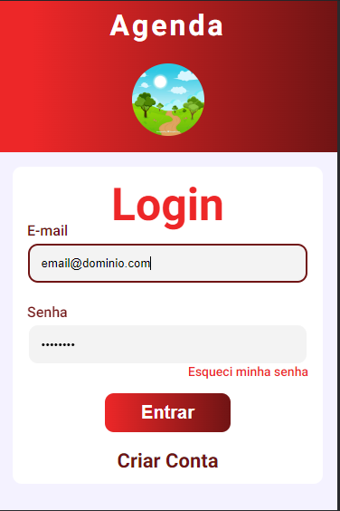

# Gerenciador De Pacientes



## Sobre
Este proj

## Sumário
1. [Configurações](#configuracao)
    * Instalação do Node.js
        * [Windows](#instalaNodeNoWindows)
        * [Mac](#instalaNodeNoMac)
        * [Liinux](#instalaNodeNoLinux)
    * [Instalando e executando o json-server](#instalaExecutaJsonServer)
2. [Tecnologias usadas](#tecnologias)
3. [Contatos](#contato)
4. [Deploy](#deploy)
5. [Problemas e Soluções](#problemaSolucao)
    * [Erro ao executar o npm](#erroNPM)
    * [Erro ao executar o Json-server](#erroJsonServer)

<a id="configuracao"></a>

### Configurações Iniciais

#### Instalação do Node.js

<a id="instalaNodeNoWindows"></a>

##### Windows
* Acessar o site oficial do [Node.js](https://nodejs.org/en);
* Baixar a versão mais recente;
* No Prompt de Comando insira:
```node --version``` para verificar se a instalação foi concluída corretamente. Virá uma resposta com a versão instalada do Node.js;

<a id="instalaNodeNoMac"></a>

##### Mac
* No terminal do Mc, insira os seguintes comandos:
    1. ```/bin/bash -c "$(curl -fsSL https://raw.githubusercontent.com/Homebrew/install/master/install.sh)"```;
    2. ```brew update```;
    3. ```brew install node```;
    4. ```node --version``` para verificar se a instalação foi concluída corretamente. Virá uma resposta com a versão instalada do Node.js;

<a id="instalaNodeNoLinux"></a>

##### Linux
* No terminal do Linux, insira os seguintes comandos:
    1. ```curl -sL https://deb.nodesource.com/setup\_13.x | sudo -E bash -```;
    2. ```sudo apt install nodejs```;
    3. ```node --version``` para verificar se a instalação foi concluída corretamente. Virá uma resposta com a versão instalada do Node.js;

<a id="instalaExecutaJsonServer"></a>

### Instalação e execução do Json-server
1. Clonar o repositório do projeto para a sua máquina
2. Instalar o Json-server:
    * Através do Prompt de Comando (ou pelo Prompt integrado do Visual Studio Code), entre na pasta do repositório do projeto;
    * Insira o seguinte comando: 
    ```npm install -g json-server```
3. Iniciar o json-server:
    * Através do Prompt de Comando (ou pelo Prompt integrado do Visual Studio Code), entre na pasta do repositório do projeto;
    * Insira o seguinte comando:
    ```json-server --watch db.json```

<a id="tecnologias"></a>

## Tecnologias


<a id="contato"></a>

## Contato
[](matheusgp.mto@outlook.com)
[](https://www.linkedin.com/in/matheuspereiradevfront/)
[](https://github.com/MathGPereira)

<a id="deploy"></a>

## Deploy
- [Vercel](https://gerenciador-de-pacientes.vercel.app/)

<a id="problemaSolucao"></a>

## Possíveis problemas e como resolvê-los

<a id="erroNPM"></a>

1. Ao executar o comando do Node Package Manager (NPM) no passo 3, é possível receber o seguinte erro:
    > O arquivo XXXX não pode ser carregado porque a execução de scripts foi desabilitada neste sistema

    ### Solução
    * Abra o seu Power Shell em modo administrador;
    * Insira o seguinte comando:
    ```Set-ExecutionPolicy -ExecutionPolicy RemoteSigned```

<a id="erroJsonServer"></a>

2. Ao executar o comando do passo 4. é possível receber o seguinte erro:
    > json-server : O termo 'json-server' não é reconhecido como nome de cmdlet, função, arquivo de script ou programa
    operável. Verifique a grafia do nome ou, se um caminho tiver sido incluído, veja se o caminho está correto e tente 
    novamente.
    No linha:1 caractere:1
    json-server --watch db.json
        + CategoryInfo          : ObjectNotFound: (json-server:String) [], CommandNotFoundException
        + FullyQualifiedErrorId : CommandNotFoundException

    ### Solução
    * Abra o Prompt de Comando (ou o prompt integrado do Visual Studio Code);
    * Entre na pasta do repositório pelo Prompt;
    * Insira o comando 
    ```npx json-server --watch db.json```
